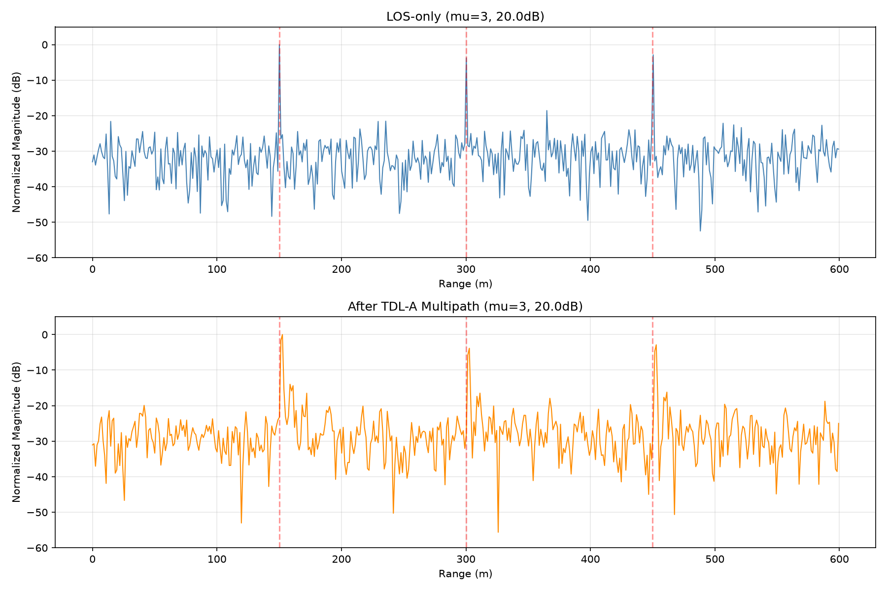
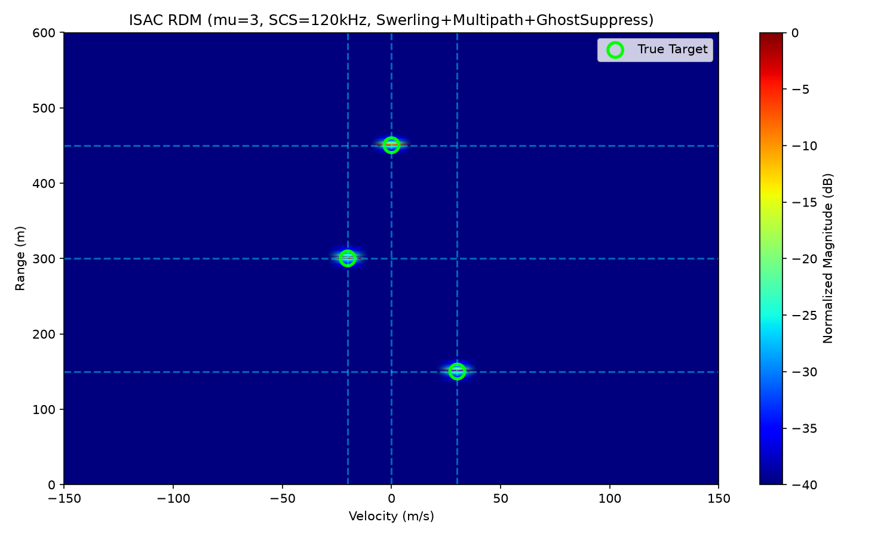
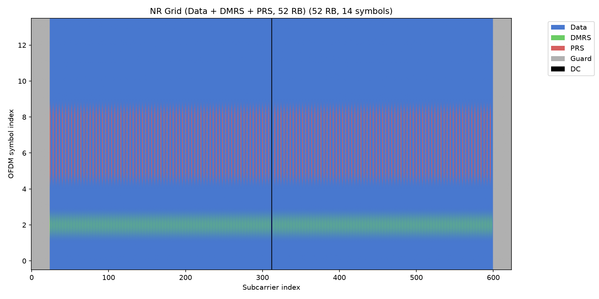
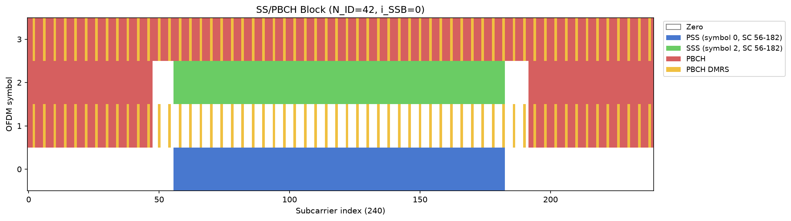
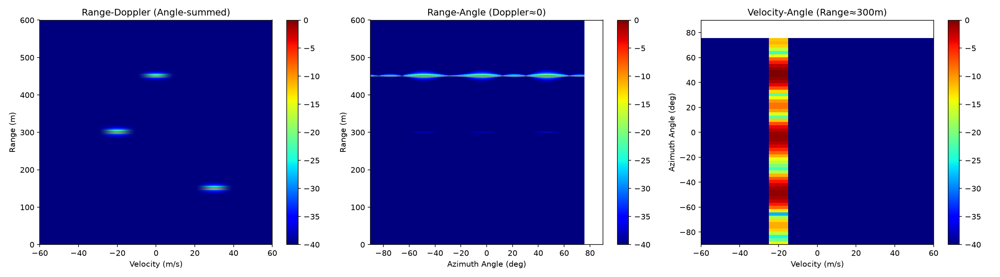
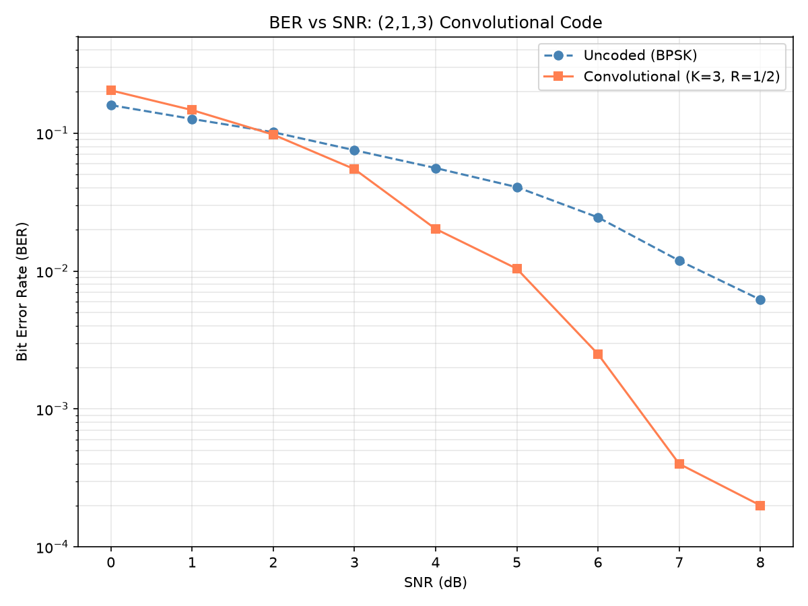
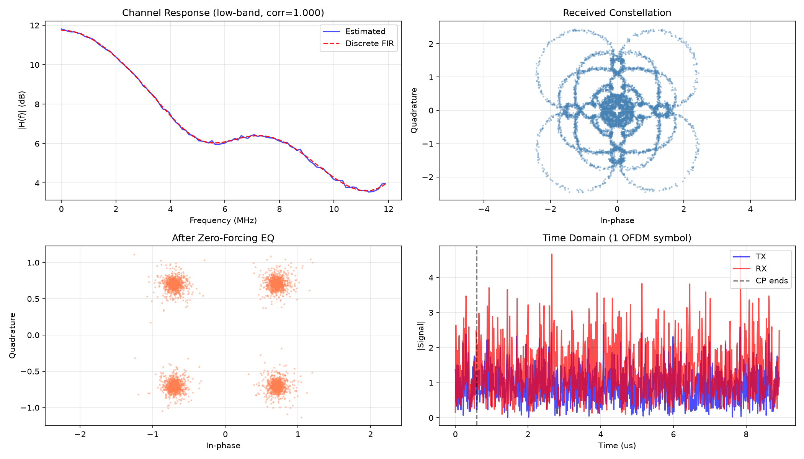
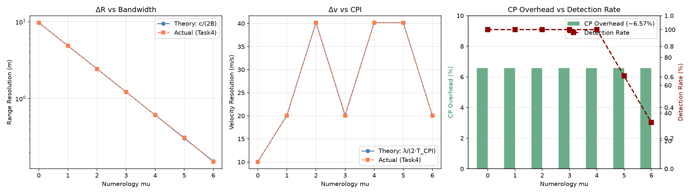

# ISAC-OFDM Agent

基于 3GPP Rel-18 参数的教学/演示型 OFDM-ISAC 仿真原型。

> ⚠️ **项目定位**：本项目用于展示从 3GPP 参数提取到 ISAC 感知处理的完整链路，
> **不声称**严格 3GPP 标准一致性，也**不适合**直接作为论文结论依据。
> 已知局限详见 [LIMITATIONS.md](LIMITATIONS.md)。

## 项目简介

本项目从 3GPP TS 38.211 v18.4.0 提取 numerology 参数，并完成从
OFDM 波形生成 → NR 资源网格 → SS/PBCH block → CP-OFDM 全链路
→ 严格时域脉冲压缩 → 3GPP TDL-A 标准多径信道 → CFAR 检测
→ MIMO 3D 感知 → 卷积编码 → 自动实验报告的完整 ISAC 链路。

- **输入**：真实 PDF（需本地下载）或仓库内的脱敏样例文本
- **输出**：RDM/RDA 图、CFAR 检测点、多径鬼影识别、BER 曲线、Markdown 报告

## 核心特性

| 模块 | 功能 | 关键技术 |
|---|---|---|
| **Task1** | 3GPP 参数提取 | pdfplumber + 容错正则，支持真实 PDF（9193 行）或样例文本 |
| **Task2** | NR 波形 + 网格 | QPSK/16QAM/64QAM/256QAM + NR 资源网格 (DC/Guard/DMRS/PRS) + SS/PBCH block |
| **Task3** | ISAC 感知 | 严格时域脉冲压缩 + 3GPP TDL-A + Swerling-I + CFAR + NMS + 鬼影抑制 + **MIMO 3D RDA** + **CP-OFDM 全链路** |
| **Task4** | 性能扫描 | 蒙特卡洛 (50 次) + 95% 置信区间 + 分辨率公式验证 |
| **Task5** | 自动报告 | 从 JSON 动态生成 Markdown |
| **P3 附加** | 进阶能力 | (2,1,3) 卷积码 + Viterbi + ULA/UPA 阵列 |

### 修复状态

- ✅ **P0**（可复现性）：输入路径动态解析 + 诚实定位 + `LIMITATIONS.md`
- ✅ **P1**（可信度）：统一 3GPP TDL-A 信道（23 抽头）+ 功率域 CA-CFAR（Pfa 校准）
- ✅ **P2**（完整度）：QPSK/16QAM 调制 + 动态报告 + 95% CI + NR 资源网格
- ✅ **P3**（进阶）：MIMO 3D RDA + (2,1,3) 卷积码 + SS/PBCH + CP-OFDM 全链路

## 主要结果

### 时域脉冲压缩 (mu=3, BW=122.88 MHz)


### TDL-A 多径信道对比 (mu=3, 23 抽头)



### 多径鬼影抑制 (mu=3, Swerling + TDL-A)

使用标准 3GPP TR 38.901 TDL-A 信道（23 抽头，RMS 时延扩展 30ns）。
在 mu=3 的 1.22m 距离分辨率下，多径扩展约 **43.5m**（≈ 35 个距离门），
因此每个真实目标在 RDM 上呈现为 **"多径簇"**：

- **绿色圈** = 簇中心（真实目标）
- **红色叉** = 被鬼影抑制算法过滤的多径点



### NR 资源网格 (P2.4)



### SS/PBCH Block (P3.3)



### MIMO 3D Range-Doppler-Angle (P3.1)



### 卷积编码 BER 曲线 (P3.2)



### CP-OFDM 全链路 (P3.4)



### 分辨率公式验证 (Task4)



## 快速开始

```bash
pip install -r requirements.txt
./run_all.sh