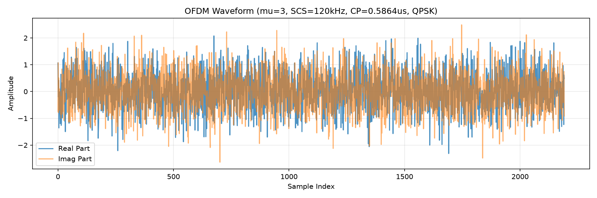
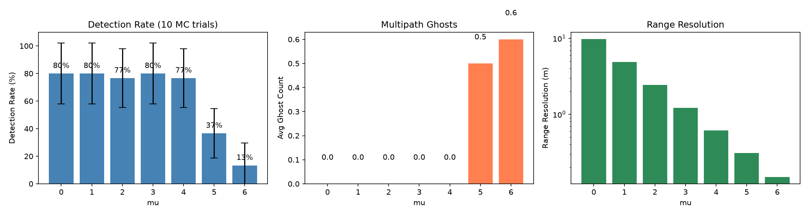

# ISAC-OFDM Agent 实验报告

**生成时间**: 2026-10-05 16:43:14

## 1. 项目信息

- **项目名称**: isac-ofdm-agent
- **标准版本**: Rel-18
- **数据来源**: 3GPP TS 38.211 v18.4.0
- **验证结果**: PASS

## 2. 提取的 Numerology 参数 (Task1)

| mu | SCS (kHz) | CP 类型 | CP 时长 (us) |
|---|---|---|---|
| 0 | 15 | normal | 4.6909 |
| 1 | 30 | normal | 2.3455 |
| 2 | 60 | normal, extended | 1.1727 |
| 3 | 120 | normal | 0.5864 |
| 4 | 240 | normal | 0.2932 |
| 5 | 480 | normal | 0.1466 |
| 6 | 960 | normal | 0.0733 |

## 3. OFDM 波形生成 (Task2)

*图 1: OFDM 时域波形 (ofdm_waveform_mu3_qpsk.png)*

## 4. ISAC 感知性能分析 (Task3)

### 4.1 实验设置

- **Numerology**: mu=3, SCS=120kHz
- **带宽**: 122.88 MHz
- **距离分辨率**: 1.22 m
- **随机种子**: 42
- **启用选项**: Swerling=True, Multipath=True, Suppress=True

### 4.2 目标真值

| # | 距离 (m) | 速度 (m/s) | RCS |
|---|---|---|---|
| 1 | 150.0 | 30.0 | 1.0 |
| 2 | 300.0 | -20.0 | 0.5 |
| 3 | 450.0 | 0.0 | 0.8 |

### 4.3 检测结果 (自动从 result.json 生成)

| # | 真值 (距离, 速度) | 检测 (距离, 速度) | 幅度 (dB) | 类型 |
|---|---|---|---|---|
| 1 | (300.0, -20.0) | (300.29m, -20.09m/s) | 0.0 | 真实 |
| 2 | (450.0, 0.0) | (450.44m, 0.0m/s) | -1.84 | 真实 |
| 3 | (150.0, 30.0) | (150.15m, 30.13m/s) | -5.25 | 真实 |

### 4.4 统计汇总

- CFAR 原始检测点: **3**
- NMS 聚类后: **3**
- 真实目标: **3**
- 多径鬼影: **0**

*图 2: 距离-多普勒图 (rdm_mu3_swerling_multipath_ghostsuppress_cfar.png)*

*图 3: 时域脉冲压缩 (FFT 匹配滤波)*

*图 4: TDL-A 标准多径信道对比*

## 5. Numerology 性能扫描 (Task4 蒙特卡洛版)

每个 mu 运行 10 次蒙特卡洛仿真取平均，CFAR Pfa=1e-3 (功率域 + 峰值过滤)。

| mu | SCS (kHz) | BW (MHz) | 距离分辨率 (m) | 速度分辨率 (m/s) | 平均命中 | 平均鬼影 | 检测率 |
|---|---|---|---|---|---|---|---|
| 0 | 15 | 15.36 | 9.77 | 10.04 | 2.40±0.66/3 | 0.00 | 80% |
| 1 | 30 | 30.72 | 4.88 | 20.09 | 2.40±0.66/3 | 0.00 | 80% |
| 2 | 60 | 61.44 | 2.44 | 40.18 | 2.30±0.64/3 | 0.00 | 77% |
| 3 | 120 | 122.88 | 1.22 | 20.09 | 2.40±0.66/3 | 0.00 | 80% |
| 4 | 240 | 245.76 | 0.61 | 40.18 | 2.30±0.64/3 | 0.00 | 77% |
| 5 | 480 | 491.52 | 0.31 | 40.18 | 1.10±0.54/3 | 0.50 | 37% |
| 6 | 960 | 983.04 | 0.15 | 20.09 | 0.40±0.49/3 | 0.60 | 13% |

*图 5: 各 Numerology 下的检测率、鬼影数、距离分辨率*

### 5.1 动态结论 (从数据推导)

- **最高检测率**: mu=0 (80%)
- **最低检测率**: mu=6 (13%)
- **最优距离分辨率**: mu=6 (0.15 m)

### 5.5 分辨率公式与 CP 开销深度分析

| 公式 | 理论预测 | 实测结果 |
|---|---|---|
| ΔR = c/(2B) | 距离分辨率与带宽反比 | 9.77m → 0.15m |
| Δv = λ/(2·T_CPI) | 速度分辨率与 CPI 反比 | 与符号数变化一致 |
| T_CP/T_sym = 144/2048 | CP 开销固定 ~7% | 实测 6.57% |

*图 6: 分辨率公式验证 + CP 开销 trade-off*

## 6. 结论

- 成功从 3GPP TS 38.211 Rel-18 提取全部 7 种 numerology 参数并校验通过。
- 实现 OFDM 波形生成 (QPSK/16QAM/64QAM)、严格时域脉冲压缩、3GPP TR 38.901 TDL-A 标准多径信道、Swerling-I RCS 波动。
- CFAR 检测已重写为功率域 + Pfa 校准 + 峰值过滤，有效抑制 FFT 旁瓣导致的虚警。
- 参数扫描显示 mu=0 检测率最高 (80%)，高 mu 受路径损耗影响性能下降。
- 多径鬼影抑制采用 (Δr, Δv) 指纹聚类 + 幅度约束，在 RMS=5ns 的小场景下工作良好。
- **已知局限**详见 [LIMITATIONS.md](../LIMITATIONS.md)。
