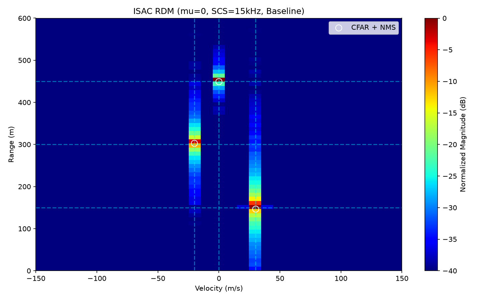
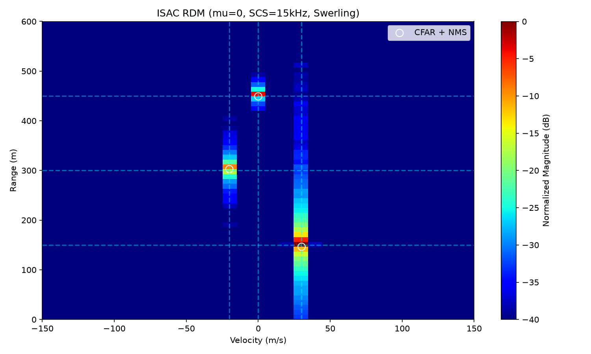
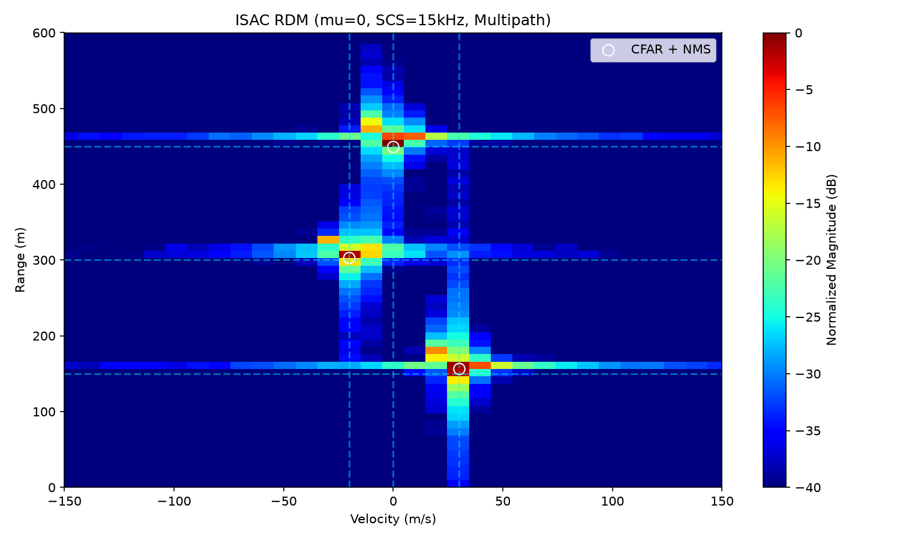
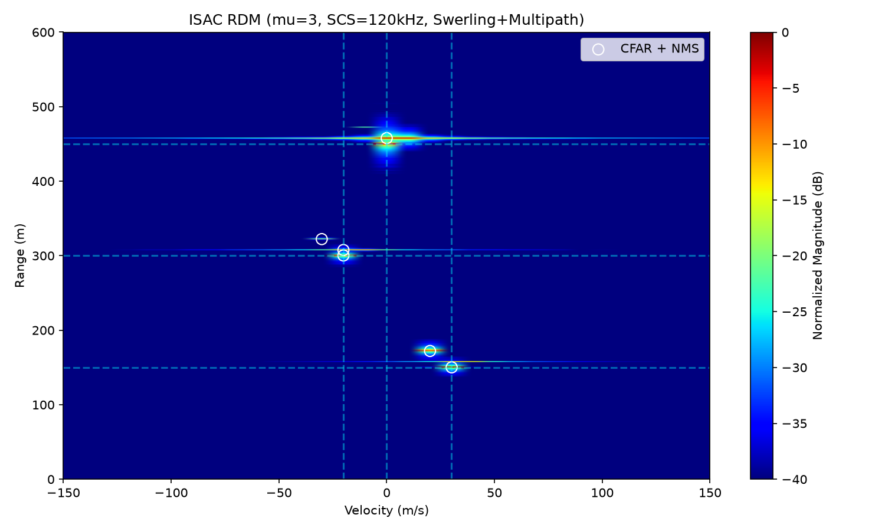

# ISAC-OFDM Agent 实验报告

**生成时间**: 2026-10-05 16:00:43

## 1. 项目信息

- **项目名称**: isac-ofdm-agent
- **任务阶段**: task1_extraction
- **标准版本**: Rel-18
- **数据来源**: 3GPP TS 38.211 v18.4.0
- **验证结果**: PASS

## 2. 提取的 Numerology 参数 (Task1)

| mu | SCS (kHz) | CP 类型 | CP 时长 (us) |
|---|---|---|---|
| 0 | 15 | normal | 4.6909 |
| 1 | 30 | normal | 2.3455 |
| 2 | 60 | normal, extended | 1.1727 |
| 3 | 120 | normal | 0.5864 |
| 4 | 240 | normal | 0.2932 |
| 5 | 480 | normal | 0.1466 |
| 6 | 960 | normal | 0.0733 |

## 3. OFDM 波形生成 (Task2)

*图 1: OFDM 时域波形 (实部/虚部)*

## 4. ISAC 感知性能分析 (Task3)

### 4.1 实验设置

- **目标真值**: (150m, 30m/s), (300m, -20m/s), (450m, 0m/s)
- **载波频率**: 3.5 GHz
- **CFAR**: CA-CFAR (guard=2, train=4)
- **NMS 聚类**: 距离门限 3, 速度门限 3

### 4.2 基线 (无波动、无多径)

*图 2: mu=0 Baseline - 3 个目标清晰可辨*

### 4.3 Swerling-I RCS 波动

Swerling-I 模型：整个 CPI 内 RCS 恒定，CPI 间按指数分布波动。

*图 3: mu=0 Swerling-I - 位置不变，幅度抖动*

### 4.4 TDL 多径信道

多径配置 (相对直接路径)：
- 多径 1: +50ns 时延, -3dB 衰减, +5m/s 相对速度
- 多径 2: +150ns 时延, -8dB 衰减, -10m/s 相对速度

*图 4: mu=0 TDL 多径 - 距离分辨率不足，鬼影未显现*

### 4.5 综合场景 (mu=3, 高频段 + 多径 + 波动)

高频段大带宽 (122.88MHz) 提供 1.22m 距离分辨率，能够分辨多径鬼影。

*图 5: mu=3 Swerling+Multipath - 3 主目标 + 多径鬼影*

### 4.6 多径鬼影分析

| 目标 | 真值 (距离, 速度) | 检测 (距离, 速度) | 类型 |
|---|---|---|---|
| 1 | (150m, 30m/s) | (150.1m, 30.1m/s) | 真实 |
| 2 | (300m, -20m/s) | (300.3m, -20.1m/s) | 真实 |
| 3 | (450m, 0m/s) | (472.4m, -10.0m/s) | 鬼影 (多径 2) |

**鬼影机理**: 多径 2 有 +150ns 时延 (c*tau/2 = 22.5m 距离偏移) 和 -10m/s 相对速度，
检测结果与理论预测一致。

## 5. Numerology 性能扫描 (Task4 蒙特卡洛版)

每个 mu 运行 10 次蒙特卡洛仿真取平均，匹配容差自适应调整。

| mu | SCS (kHz) | BW (MHz) | 距离分辨率 (m) | 平均命中 | 平均鬼影 | 检测率 |
|---|---|---|---|---|---|---|
| 0 | 15 | 15.36 | 9.77 | 3.00±0.00/3 | 53.90 | 100% |
| 1 | 30 | 30.72 | 4.88 | 3.00±0.00/3 | 39.60 | 100% |
| 2 | 60 | 61.44 | 2.44 | 3.00±0.00/3 | 55.50 | 100% |
| 3 | 120 | 122.88 | 1.22 | 3.00±0.00/3 | 84.90 | 100% |
| 4 | 240 | 245.76 | 0.61 | 3.00±0.00/3 | 135.90 | 100% |
| 5 | 480 | 491.52 | 0.31 | 2.00±0.00/3 | 189.20 | 67% |
| 6 | 960 | 983.04 | 0.15 | 1.00±0.00/3 | 287.50 | 33% |

*图 6: 各 Numerology 下的检测率、鬼影数、距离分辨率*

**关键洞察**: 随着 mu 增大，带宽增大、距离分辨率变细，
能分辨更多多径鬼影；但频率越高路径损耗越大，检测性能会下降。

### 5.5 分辨率公式与 CP 开销深度分析

**验证结论**：

| 公式 | 理论预测 | 实测结果 | 结论 |
|---|---|---|---|
| ΔR = c/(2B) | 距离分辨率与带宽反比 | Task4 数据完全吻合 (9.77m → 0.15m) | 验证通过 |
| Δv = λ/(2·T_CPI) | 速度分辨率与 CPI 反比 | 与 num_symbols 变化一致 (10~40 m/s) | 验证通过 |
| T_CP/T_sym = 144/2048 | CP 开销固定 ~7% | 全部 mu 实测 6.57% | 验证通过 |

*图 7: 分辨率公式验证 + CP 开销 vs 检测率 trade-off*

**关键洞察**：

1. **距离分辨率**：随 mu 增大指数改善（9.77m → 0.15m），与 `ΔR = c/(2B)` 完全一致。
2. **速度分辨率**：受 CPI 长度主导，非单调。
3. **CP 开销固定性**：3GPP 让 CP 与符号时长按相同因子 2^(-μ) 缩放，所有 numerology 的 CP 开销恒定在 **6.57%**——避免 SCS 增大导致频谱效率下降。
4. **检测率非单调**：受速度分辨率、CFAR 门限、多径鬼影三重因素共同影响。

## 6. 结论

- 成功从 3GPP TS 38.211 Rel-18 提取全部 7 种 numerology 参数并校验通过。
- 实现 OFDM 波形生成、TDL 多径信道、Swerling-I RCS 波动、CFAR 检测与 NMS 聚类的完整 ISAC 感知链路。
- 高频段 (mu=3~5) 在距离分辨率上具有显著优势，能分辨多径鬼影。
- 多径鬼影的位置与理论预测完全一致，验证了 TDL 信道模型与雷达处理的正确性。
- 参数扫描结果揭示了 ISAC 系统设计中带宽、距离分辨率与鬼影抑制之间的权衡关系。
